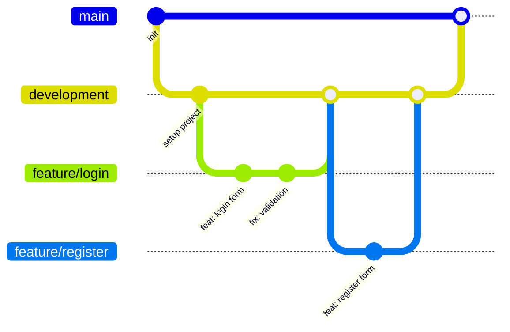

# Workshop Pemrograman - Panduan Kolaborasi GitHub

## Deskripsi

Dokumen ini berisi aturan dan alur kerja (workflow) yang digunakan dalam pengerjaan project masing-masing menggunakan Git dan GitHub.

Tujuan dari aturan ini adalah agar pengerjaan project tim lebih terstruktur, mudah dikelola, serta meminimalkan konflik kode.

---

# 1. Repository GitHub

- Project wajib diupload ke **Repository GitHub**.
- Repository dibuat oleh **Project Manager atau programmer**.
- Semua anggota tim harus diundang sebagai **Collaborator**.
- Pastikan akun berikut juga diinvite:

```
bagusaliakbar77@gmail.com
```

---

# 2. Setup Project

Setelah mendapatkan akses repository:

- Semua anggota wajib Clone atau Fork repository melalui editor masing-masing (VS Code / Antigravity / dll).
- Pastikan project dapat dijalankan di environment masing-masing.

---

# 3. Selalu Pull Sebelum Memulai

Sebelum mulai mengerjakan fitur, setiap anggota **WAJIB melakukan pull terlebih dahulu** agar mendapatkan kode terbaru.

```
git checkout development
git pull origin development
```

Hal ini penting untuk:

- Menghindari konflik kode saat push atau merge
- Menggunakan versi project terbaru

Setelah itu baru membuat branch fitur.

---

# 4. Struktur Branch (Git Workflow)

Project menggunakan struktur branch berikut:

```
feature/nama-fitur -> development -> main
```

Penjelasan:

- **main** : branch utama (versi stabil)
- **development** : branch penggabungan semua fitur
- **feature/** : branch khusus untuk setiap fitur

Contoh:

```
feature/login
feature/register
feature/dashboard
feature/database
```

---

# 5. Membuat Branch Fitur

Branch fitur dibuat dari branch **development**.

```
git checkout development
git pull origin development
git checkout -b feature/nama-fitur
```

Contoh:

```
git checkout -b feature/login
```

---

# 6. Aturan Commit

- Tidak melakukan commit secara masal.
- Commit dilakukan **per fitur atau perubahan kecil**.
- Gunakan commit message yang jelas.

## Format Commit Message

```
<type>: <deskripsi perubahan>
```

## Jenis Commit

### feat

Menambahkan fitur baru

Contoh:

```
feat: add login feature
feat: create user registration
```

### fix

Memperbaiki bug atau error

```
fix: fix login validation
fix: resolve database connection error
```

### refactor

Perbaikan struktur kode tanpa mengubah fungsi utama

```
refactor: simplify authentication logic
refactor: improve folder structure
```

### docs

Perubahan atau penambahan dokumentasi

```
docs: update README
```

---

# 7. Push Perubahan

Setelah melakukan commit:

```
git push origin nama-branch
```

Contoh:

```
git push origin feature/login
```

---

# 8. Pull Request

Jika fitur sudah selesai:

1. Push branch ke GitHub
2. Buat **Pull Request**
3. Target merge ke **development**
4. Tunggu review
5. Setelah disetujui baru di merge

---

# 9. Kontribusi Anggota

Setiap anggota wajib berkontribusi dalam:

- pembuatan fitur
- commit code
- pull request

Kontribusi akan dilihat dari riwayat commit di GitHub.

---

# 10. Tugas Project Manager

Project Manager bertanggung jawab untuk:

- Membuat repository atau delegasikan ke programmer
- Mengundang semua anggota sebagai collaborator
- Mengatur pembagian tugas fitur
- Memastikan workflow Git berjalan dengan benar
- Memastikan semua anggota berkontribusi

---

# 11. Evaluasi

akan diperiksa pada pertemuan berikutnya berdasarkan:

- Struktur repository
- Manajemen branch
- Riwayat commit
- Kontribusi anggota
- Fitur yang telah dibuat

---

# Tujuan Workflow

Dengan workflow ini diharapkan:

- Project lebih terstruktur
- Kerja tim lebih rapi
- Riwayat perubahan mudah dilacak
- Menghindari konflik kode
- Mudah melakukan rollback jika terjadi error

# Diagram Workflow Git




Diagram di atas menggambarkan alur kerja:

1. `main` adalah branch utama (versi stabil).
2. `development` menjadi tempat penggabungan semua fitur.
3. Setiap anggota membuat branch `feature/*` dari `development`.
4. Setelah fitur selesai → merge ke `development` melalui Pull Request.
5. Jika semua fitur stabil → `development` di-merge ke `main`.

---

